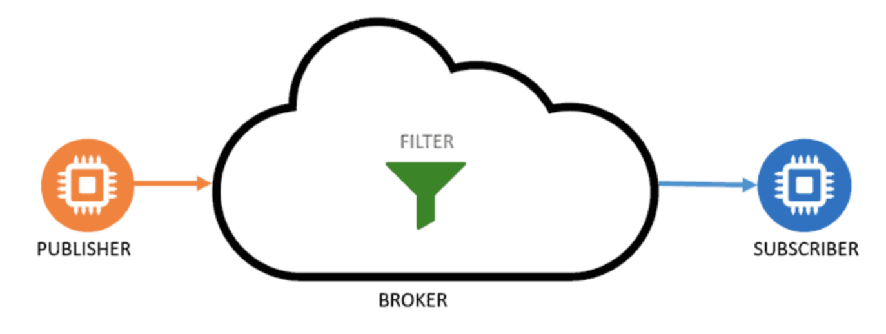

# MQTT

El protocolo MQTT se ha convertido en uno de los principales pilares del IoT por su sencillez y ligereza. MQTT son las siglas MQ Telemetry Transport. El funcionamiento del MQTT es un servicio de mensajería push con patrón publicador/suscriptor (pub-sub). Como vimos en la entrada anterior, en este tipo de infraestructuras los clientes se conectan con un servidor central denominado broker.

Para filtrar los mensajes que son enviados a cada cliente los mensajes se disponen en topics organizados jerárquicamente. Un cliente puede publicar un mensaje en un determinado topic. Otros clientes pueden suscribirse a este topic, y el broker le hará llegar los mensajes suscritos. Los clientes inician una conexión TCP/IP con el broker, el cual mantiene un registro de los clientes conectados. Esta conexión se mantiene abierta hasta que el cliente la finaliza. Por defecto, MQTT emplea el puerto 1883 y el 8883 cuando funciona sobre TLS.

MQTT dispone de un mecanismo de calidad del servicio o QoS, entendido como la forma de gestionar la robustez del envío de mensajes al cliente ante fallos (por ejemplo, de conectividad).

MQTT tiene tres niveles QoS posibles.

* QoS 0 unacknowledged (at most one): El mensaje se envía una única vez. En caso de fallo por lo que puede que alguno no se entregue.

* QoS 1 acknowledged (at least one): El mensaje se envía hasta que se garantiza la entrega. En caso de fallo, el suscriptor puede recibir algún mensaje duplicados.

* QoS 2 assured (exactly one). Se garantiza que cada mensaje se entrega al suscriptor, y únicamente una vez.

[[CTO]]
[[iot]]
[[iotcore.md]]

[//begin]: # "Autogenerated link references for markdown compatibility"
[ioled]: ioled "iOLED"
[CTO]: CTO "CTO"
[iot]: iot "IoT"
[//end]: # "Autogenerated link references"