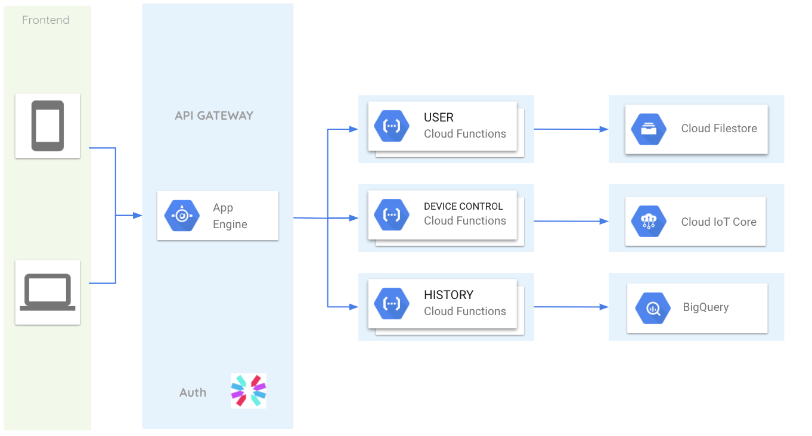

# Nube iOLED

## Documentación de la nube de iOLED
La principal tarea de la nube de iOLED es la administración y control de los dispositivos antü conectados a Internet.

Las principales funciones que la nube ACTUALMENTE desarrola son:

* Control de manejo de usuarios
* Control de dispositivos
* Guarda los datos en una base de datos
* Despliegue historico de los datos

Toda la información actualmente se encuentra desplegada en [[google-cloud]] sin embargo es posible realizar la migración a otra plataforma en la nube.

## Arquitectura de la nube iOLED

ACTUALMENTE la nube de iOLED funciona con una arquitectura de microservicios. Se esta trabajando a una migración a un servicio monolitico ya que es más facil el desarrollo en equipos chicos.

## Mongoose OS
An open source _Operating System_ for the Internet of Things. Supported microcontrollers: ESP32, ESP8266, STM32, TI CC3200, TI CC3220.

## Documentación

- [iotcore/mqtt-samples](https://cloud.google.com/iot/docs/samples/mqtt-samples) - MQTT en IoT COre
- [iotcore/nodejs](https://cloud.google.com/iot/docs/how-tos/mqtt-bridge#iot-core-mqtt-auth-run-nodejs) - Publicando mensajes MQTT con Iot Core en nodejs
- [iotcorre/devices](https://cloud.google.com/iot/docs/concepts/devices) - Definiciones de config, state y commands

[[ioled]]
[[CTO]]

[//begin]: # "Autogenerated link references for markdown compatibility"
[ioled]: ioled "iOLED"
[CTO]: CTO "CTO"
[google-cloud]: google-cloud "Google Cloud"
[//end]: # "Autogenerated link references"